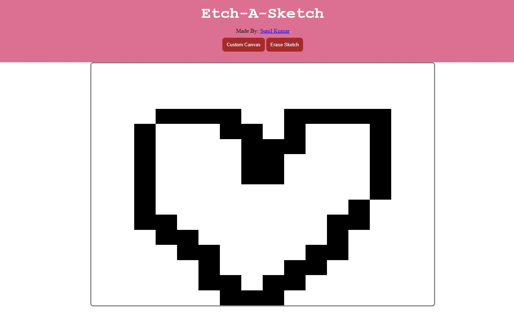
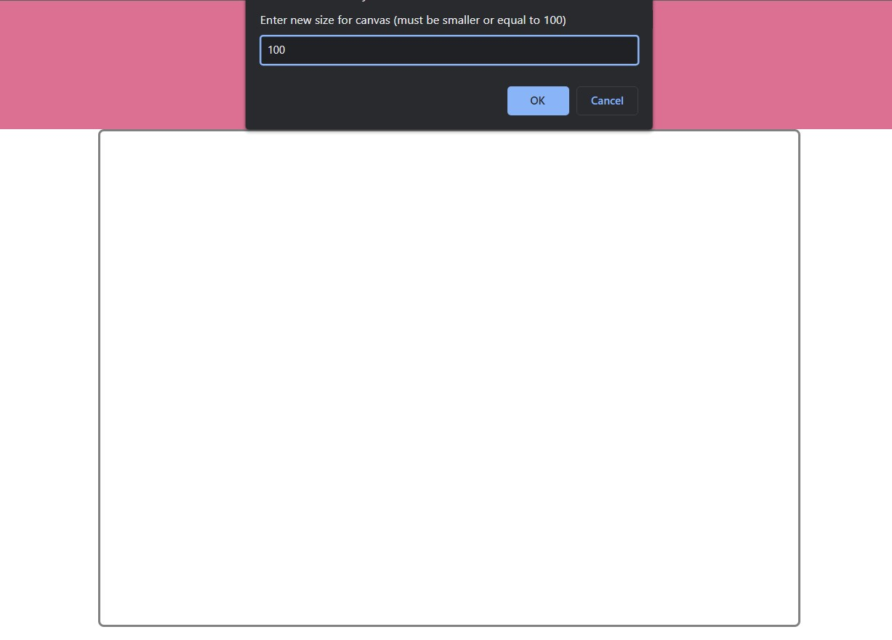
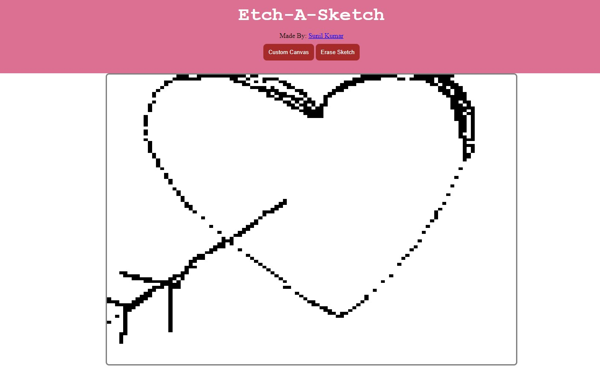

# Etch A Sketch
Etch-A-Sketch is a sketching website where users can sketch or draw whatever they want. Users can choose custom cnvas size as well. This project is an assignment of The Odin Project Full Stack Development.

## Objectives
* Learn and showcase DOM manipulation with JavaScript.
* Implement JavaScript functions.
* Work with EventListeners.
* Work with flexbox.
* Manipulate CSS with JavaScript.

## Screenshots

